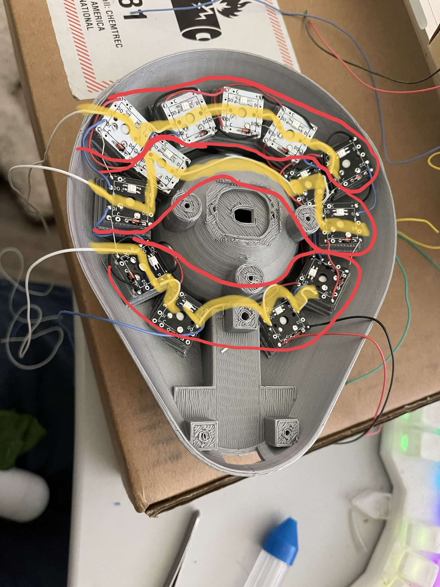
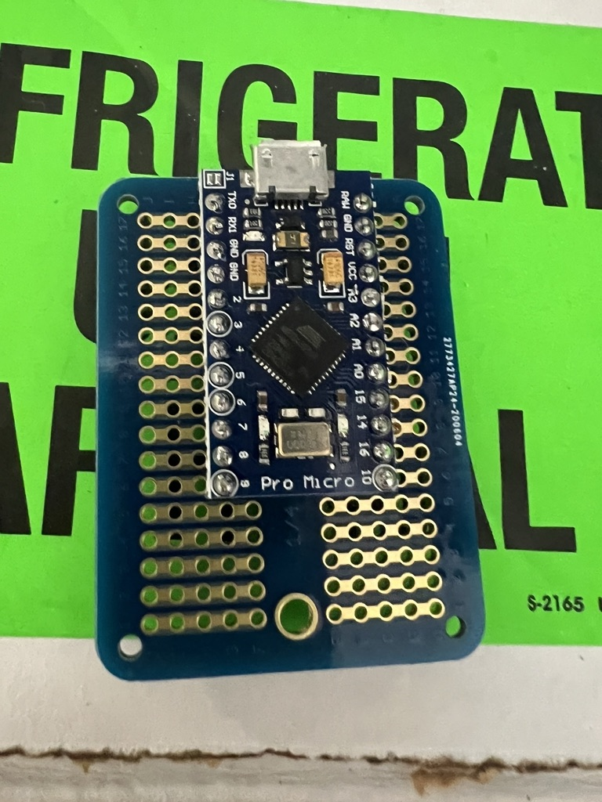
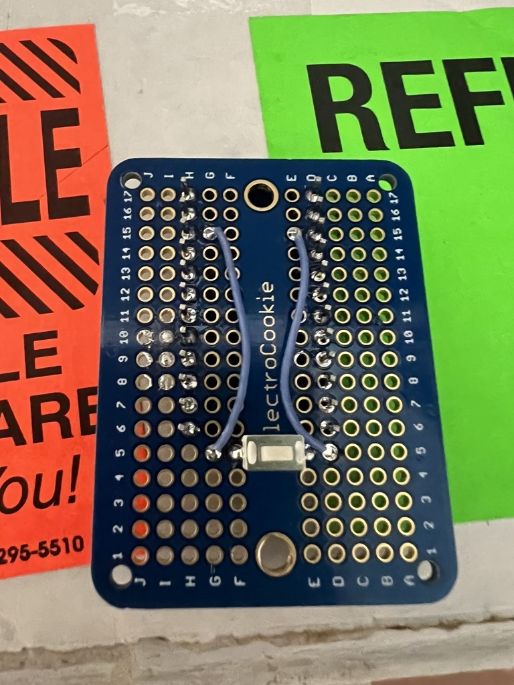
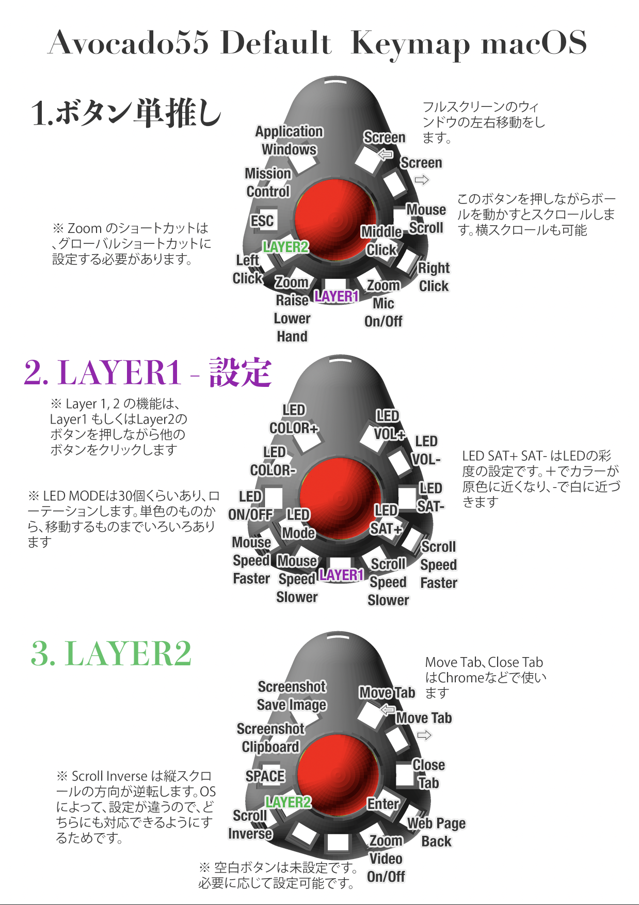
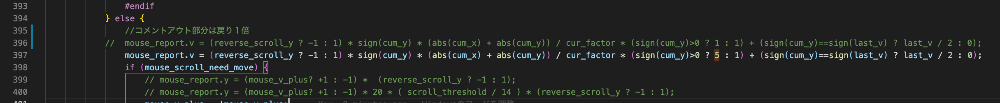

# Avocado55
自作トラックボール、Avocado 55 の3D設計ファイル及び制作ガイドです

# 必要な材料
- FDM 3Dプリンタ (ケース、キーキャップ、ボールのいずれかを印刷する場合)
- ケース
- フィラメント
- ボールトランスファーベアリング CY-8H
https://www.amazon.co.jp/Sndy-10-直径ボール金属搬送軸受ユニットコンベアローラー-CY-8h-ボールベアリング/dp/B07GT5PFNB
アメリカだと
https://www.amazon.com/gp/product/B07BVLWK7Q


- キースイッチ Cherry MX 互換サイズ キーの数(13)
開発者は、Kailh Box Pink Silent が軽量で使いやすかったためこちらを選択
- 無限の可能性 SuXeN 1キー毎のPCB キーの数 (13)
- ElectroCookie ミニブレッドボード(10x)
https://www.amazon.co.jp/dp/B07W6DVT6Z
- Promicro USB-Cにしたい場合は、SparkFun Qwiic Pro Micro なども可能 
https://yushakobo.jp/shop/sparkfun-qwiic-pro-micro-usb-c-atmega32u4/
- ピンヘッダ (コンスルーなど)
https://yushakobo.jp/shop/a01mc-00/
- YS-SK6812MINI 足付きLED
- はんだ
- はんだ吸い取り線(失敗した時のみ必要)
- 配線用のケーブル
(例)
https://www.amazon.co.jp/ストライブデー-Striveday™-箱入りシリコンワイヤー-24AWG-CECOMINOD044232/dp/B07CVB66YB
- ダイオード 1N4148 キーの数 (13)
https://yushakobo.jp/shop/a0800di-01-100/
- M2、M3ねじセット
(例)
https://www.amazon.co.jp/Akozon-SS304%E3%82%B9%E3%83%86%E3%83%B3%E3%83%AC%E3%82%B9%E9%8B%BC-M2-M2-5-%E7%9A%BF%E5%B0%8F%E3%81%AD%E3%81%98%E3%83%9C%E3%83%AB%E3%83%88%E3%82%A2%E3%82%BD%E3%83%BC%E3%83%88%E3%82%BB%E3%83%83%E3%83%88/dp/B08C2G18FF
- インサートナット M2-M3セット（必要に応じて）
https://www.amazon.co.jp/Atpwonz-%E3%82%A4%E3%83%B3%E3%82%B5%E3%83%BC%E3%83%88%E3%83%8A%E3%83%83%E3%83%88-330%E5%80%8B%E3%82%BB%E3%83%83%E3%83%88M2-M5%E3%83%AD%E3%83%BC%E3%83%AC%E3%83%83%E3%83%88%E3%83%8A%E3%83%83%E3%83%88-%E7%9C%9F%E9%8D%AE%E3%82%A4%E3%83%B3%E3%82%B5%E3%83%BC%E3%83%88/dp/B089YS7KHT
- キーキャップ (印刷も可能 キー数13
- トラックボール用ボール55mm (ケンジントンエキスパートマウス互換 印刷も可能だが、印刷した場合、根気よく複数のやすりで表面がツルツルになるまで研磨する必要がある)
https://www.amazon.co.jp/ぺリックス-トラックボール-光沢仕上げ-他社55mmトラックボールマウスと互換性あり【正規保証品】-PERIPRO-304/dp/B07DXBMT6Z
- PMW3360 PCB付き
https://www.tindie.com/products/jkicklighter/pmw3360-motion-sensor/?pt=ac_prod_search
- エポキシ（用途に応じて）
micro USBのPro Microを使用する場合や、ボールを自作するときに使います。２液混合タイプで、プラスチック対応のものであれば問題ありません。
-  ゴム足（3つ）
直径8mm以内の物

## 工具など
- ハンダゴテ　温度調整可能なもの
- ハンダゴテホルダー
- ニッパー 
- 精密ドライバー
- ワイヤーストリッパー
https://www.amazon.co.jp/アイウィス-IWISS-ワイヤーストリッパー-Φ0-6-2-6mm-20-10AMG/dp/B01GDVWVUG/
- ノギス特にボールとセンサーの深さを図るのに便利

## ソフトウェア環境
### トラックボールのファームウェア設定
- QMK Firmware
https://docs.qmk.fm/#/contributing?id=previewing-the-documentation
ここから環境を作成しておく


### 3Dデザイン
- OpenSCAD 
https://www.openscad.org
出来合いのSTLから調整したい場合に使用します。完成品のSTLを印刷する場合は不要です。

- Ultimaker Cura スライサー
https://ultimaker.com/ja/software/ultimaker-cura
STLからの印刷に自分好みのスライサーがある場合、そちらを使用ください。
Curaの良い点は、ツリーサポートに対応している点で、サポート部分を印刷後に簡単に剥がすことが可能です。


# 工程
## ボールの調達、作成
トラックボールのパーツで、一番大切なものは、ボールです。ボールを使って、精度のチェックや回し心地も変わるため、使用する予定のボールを最初に決めることをお勧めします。
1. 市販品のボール
    自作のボールより、市販品のボールの方が、クオリティが高いです。すでにエキスパートマウスなどの55mmボールを持っていて、はずして使用していい場合は、その流用することができます。なければ、Amazon  でPerixx製の替ボールなどを購入することもできます。
1.  自作ボール
自作ボールはとても時間がかかります。半分のパーツ ******.stlを2つ印刷して、エポキシ（２液混合の接着剤）で貼り付けます。印刷設定は、細かいものに越したことはありませんが、CuraのExperimental (試験機能)のAdaptive Layerを使用すると上の部分だけ細かく印刷するなども可能です。私は、一番細かな、上部の印刷が0.16mmになるくらいの精度で半分が3時間くらいかかる設定で印刷しました。
貼り付ける際に、ズレが最小になるように、印刷でできた穴に1.75mmのフィラメントを差し込みます。全ての穴に差すのは難しいので私は５個くらいだけ差し込みました。
印刷後に#240くらいのヤスリでスタートして#320,#400,#600,#1000,#1500,#2500と細かくやすりをかけていきます。私は電動のやすりを持っていないので、手で濡らしながらやすりかけしましたが、２時間くらいかけました。
その後、布で磨いたり、液体のコンパウンド（ピカール的なもの）で磨いたりして、最終的にピカピカになるまで磨きました。ケースと並行で作って、トラッキングしながら回し心地と、トラッキング精度のバランスを見ながら、どれほど磨くかを決めることもできます。

## ケースの調達
ケースを決めるためにあたって重要なのは、トランスファーベアリングです。CY-8Hという、8mmボールのベアリングが3つ必要ですが、3つは全く同じものを購入するようにしてください。私の把握している範囲で、蓋の折り返し部分が2mmほどのものと、3mmほどのものがあり、それぞれでケースのベアリングの穴のサイズを調整する必要があります。
UPO55b1.stl ベアリングのタイプ１ 折り返しが3mmほどのもの。uxcellブランドのものなどはこちらになります。
UPO55b2.stl ベアリングのタイプ２折り返しが2mmほどのもの。
この選択はとても重要で、ベアリングサイズ違いのため、ボールの位置が変わってしまうことにより、トラッキングがうまくいかなかったり、トラッキング時に微妙なズレが発生する可能性もあります。
そのため、ベアリングとボールの調整を行うために、全体の3Dプリントを行う前にボール受け部分だけで印刷してテストすることをお勧めいたします。
cup55b1.stl ベアリングのタイプ１ 折り返しが3mmほどのもの。uxcellブランドのものなどはこちらになります。
cup55b2.stl ベアリングのタイプ２折り返しが2mmほどのもの。
これらのどちらか近いと思うものを印刷して、ベアリングをセットして、ボールを入れたときに、下部のセンサー穴から、ボールまでの距離をノギスなどで測ります。これが2.5mmくらいになるのが、センサーメーカーより推奨されています。私の手元でテストした限りだと、2mm-3.5mmくらいまでだと、問題なくトラッキングできるように感じています。ここで起きる問題としては、ベアリングが深く埋まりすぎて、ベアリングにあたらずに下の天面にボールが当たってしまうと、ボールがスムースに回りません。また、3Dプリントの精度の問題で、ベアリングが最後まで押し込まれない場合、ボールが浮きすぎて、センサーからの距離が離れてしまう場合があります。その場合は、一度ベアリングをはずしてベアリング部分についている印刷時のゴミなどをやすりなどで取り除いてから、再度ベアリングを入れます。そして、指などでベアリングを押し込みます。このとき、トラックボールのボールを使って、ベアリングを押し込まないようにしてください。ベアリングの内部が壊れて、ベアリングが正しく動作しなくなることがありました。そのようにして、ベアリングのタイプを決定してから、ケースを印刷してください。

## ケースの確認

ケースのプリントが成功したら、ボール、キースイッチ、キーキャップをつけて操作感をイメージしてみると良いかもしれません。キットには複数パターンのトラックボールファイルがありますので、はんだ付けする前に、ここで別のケースに変更するのも良いかもしれません。

## 無限の可能性の準備
無限の可能性にYS-SK6812MINIをはんだ付けします。Lのマークがある部分にLEDの脚の切り欠きがある部分を合わせて４つの足をはんだ付けします。この作業はハンダがつきにくく、接触不良でLEDが光らない可能性があります。下記のリンクのように、helixのLEDテストなどをProMicroに書き込んで、 ブレッドボードなどで動作確認を行うこともできます。
https://github.com/swanmatch/colosseum60#ledsk6812mini%E3%81%AE%E5%AE%9F%E8%A3%85

加えて、ダイオード 1N4148をかくブロックにはんだ付けします。方向およびどちらの面に接続するかにご注意ください。LEDとダイオードは下面（使用時に下に来る方向、LEDの接点がある面）に接続します。

全てのブロックにLEDとダイオードを配線し、各ブロックを切り離して使用します。Avocado55では13個のキーを使用します。


## 各キーの配線

- キースイッチを各所に配置して、無限の可能性とキースイッチの足をはんだ付けします。キースイッチは手前にLEDが来る方向に設置します。
- 各PCBの + をダイオードの足やエナメル線で結線します。そのうち１本をPromicroに接続できるように、長いエナメル線などで取り出しておきます。この際、固定の１色を使うとわかりやすいです。個人的にはこれには黒を使用しています。

- 各PCBの - をダイオードの足やエナメル線で結線します。そのうち１本をPromicroに接続できるように、長いエナメル線などで取り出しておきます。この際、固定の１色を使うとわかりやすいです。個人的にはこれには赤を使用しています。

- 各PCBのデータ線をダイオードの足やエナメル線で結線します。この順番でLEDのアニメーションなどが動くのですが、Avocadoの場合は、円形に接続されれば問題ありません。私は、右上の時計で言う1時の位置のキーからスタートして、時計回りで結線していきます。1時のキーのDIに接続した線を、Promicroに接続できるように取り出しておきます。次のキーに接続する際は、前のキーのDOから出した線を次のキーのDIに接続します。

- PCBのROW（行）をつなげます。Avocado55では一行目4つ（一番上の行）、二行目4つ（真ん中）、三行目5つでソフトウェアを設定しています。二行目と三行目が画像で見るとわかるように、内側、外側で分かれているのでご注意ください。同じ行同士をつなげて、１本をPromicro接続のために取り出します。

- PCBのCOL(列)をつなげます。Avocado55では1,2,4,5列が3つづつ、3列目が1つのキーと設定しています。


## ブレッドボードの作成
ブレッドボードにPromicroをはんだ付けします。コンスルーを用いて、着脱可能にすることも可能です。位置は以下のようにします

|ブレッドボード上の位置|Promicroのピン|
|---|---|
|D17|RAW|
|H17|TX0|
|D6|9|
|H6|10|




Promicro の接続ができたら、リセットスイッチを設定します。GNDとRSTをスイッチの各端子に接続します。
|ブレッドボード上の位置|配線|
|---|---|
|G15|RST G5と接続|
|G5|RST G15と接続|
|E15|GND D5と接続|
|D5|GND E15と接続|
|F5|スイッチ端子1|
|E5|スイッチ端子2|



ここまでできたら、ケースにブレッドボードをネジ付します。

# キー配線とブレッドボードの配線
|ブレッドボード上の位置|配線|
|---|---|
|J14|VCC PCBの(+)と接続|
|J16|GND PCBの(-)と接続|
|A17|DATA TX0 PCBの1つ目のDIと接続|


|ブレッドボード上の位置|配線|
|---|---|
|A8|Promicro7 PCBの一番右(1列目)のCOLと接続|
|A9|Promicro6 PCBの2列目のCOLと接続|
|A10|Promicro5 PCBの3列目のCOLと接続|
|A11|Promicro4 PCBの4列目のCOLと接続|
|A12|Promicro3 PCBの一番左(5列目)のCOLと接続|
|I6|Promicro10 PCBの一番上1行目のROWと接続|
|B6|Promicro10 PCBの2行目のROWと接続|
|B7|Promicro10 PCBの一番下3行目のROWと接続|


ここまでで、キーとの配線が終了です。ボールのセンサーをつけていませんが、この時点でファームウェアをPromicroにインストールすると、キーの設定が動作します。


## センサーの接続
レンズこみでセンサーをネジではめます。この際に、レンズとケースの底面が2.5-3mmの時に最もトラッキングのパフォーマンスが良くなります。
センサーの方向は、端子が手前にくる形ではめるようにプログラムされています。

|ブレッドボード上の位置|センサーの配線|
|---|---|
|I14|VI  Promicro VCC|
|J8|MI  Promicro 14|
|J7|MO Promicro 16|
|J9|SC  Promicro 15|
|J10|SS  Promicro A0|
|A15|GD  Promicro GND|


上記で配線は終了です。お疲れ様でした。

下の蓋をはめて組み立ては完成です。

# ソフトウェア設定

QMK Firmware を使用するのですが、私の作成したリポジトリをQMK 本家にプルリクエストを出していないため、私の作成したリポジトリを使用する必要があります。
QMKのインストールは、本家と同じですが、以下で私のリポジトリをクローンします。

``` bash or zsh
git clone https://github.com/tomohisa/qmk_firmware.git
```

ファームウェアのインストール
``` mac 版
make handwired/avocado:default:avrdude 
```

``` windows 版
make handwired/avocado:windefault:avrdude 
```

##  キーのカスタマイズ
以下のキーの部分を書き換えてください

``` keymap.c
const uint16_t PROGMEM keymaps[][MATRIX_ROWS][MATRIX_COLS] = {
    /* Base */
    [_BASE] = LAYOUT(
        LGUI(KC_TAB),    LGUI(KC_D),      LALT(LSFT(KC_TAB)),  LALT(KC_TAB),
        KC_ESC,         MO(_FN2),           KC_BTN3,        KC_MOUSEMODE_SCROLL_ON_PRESS,
        KC_BTN1,    LALT(KC_Y)    ,   MO(_FN),        LALT(KC_A),                    KC_BTN2
    ),
    [_FN] = LAYOUT(
        RGB_HUI,    RGB_HUD,   RGB_VAI,    RGB_VAD,
        RGB_TOG,    RGB_MODE_FORWARD,    RGB_SAI, RGB_SAD,
        KC_CPI_UP,  KC_CPI_DOWN,  MO(_FN),  KC_SCROLLSPEED_DOWN,   KC_SCROLLSPEED_UP
    ),
    [_FN2] = LAYOUT(
        LGUI(LSFT(KC_S)),   LGUI(KC_PSCREEN), LCTL(LSFT(KC_TAB)),    LCTL(KC_TAB),
        KC_SPACE,    KC_NO,    KC_ENTER, LCTL(KC_W),
        KC_SCROLL_INVERSE,  KC_NO,  KC_NO,  LALT(KC_V),   LALT(KC_LEFT)
    )
};
```

macとWindowsのデフォルトは以下のものです。



## マウス動作のカスタマイズ

個人的な好みで、スクロールアップをスクロールダウンの５倍早くしています。気に入らない場合は、ファームウェアを調整してください。



``` keymap.c
    //コメントアウト部分は戻り１倍
//  mouse_report.v = (reverse_scroll_y ? -1 : 1) * sign(cum_y) * (abs(cum_x) + abs(cum_y)) / cur_factor * (sign(cum_y)>0 ? 1 : 1) + (sign(cum_y)==sign(last_v) ? last_v / 2 : 0);
    mouse_report.v = (reverse_scroll_y ? -1 : 1) * sign(cum_y) * (abs(cum_x) + abs(cum_y)) / cur_factor * (sign(cum_y)>0 ? 5 : 1) + (sign(cum_y)==sign(last_v) ? last_v / 2 : 0);
```