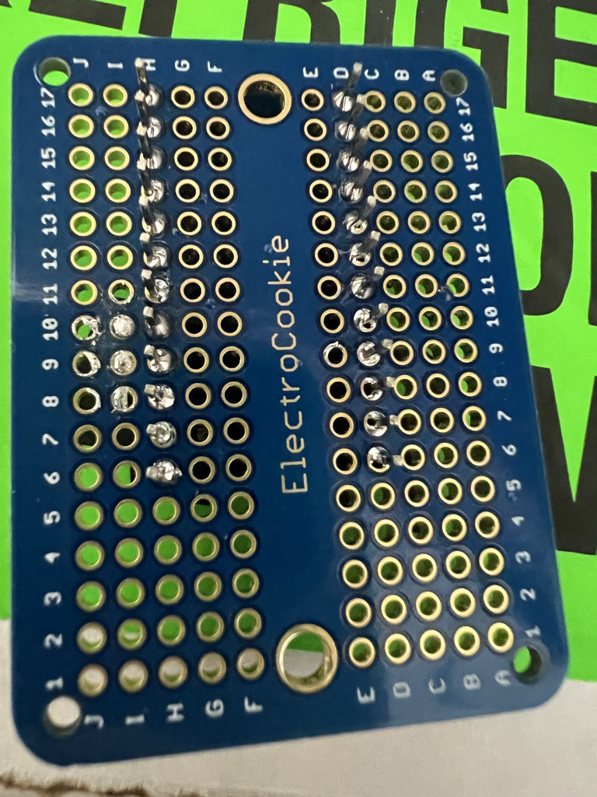

# Avocado55

3D design files and production guide for Avocado 55, a self-made trackball. It is released under MIT license, including STL SCAD. Feel free to use them for your own projects. If you have any questions, please contact me on twitter @tomohisa. Or create an issue in this repository.


## Known Issues
On macOS logon screen, Avocado mouse cursor is not been able to move. Please understand for device like an iMac, Avocado 55 might not be able to use as only mouse deviced.


# 必要な材料
- FDM 3D printer (for printing cases, keycaps, or balls)
- Case
- Filament
- Ball transfer bearing CY-8H<br />
Japanese Amazon
https://www.amazon.co.jp/Sndy-10-直径ボール金属搬送軸受ユニットコンベアローラー-CY-8h-ボールベアリング/dp/B07GT5PFNB<br />
US Amazon
https://www.amazon.com/gp/product/B07BVLWK7Q
- Key Switches Cherry MX compatible (13 keys)<br>
I personally use Kailh Box Pink Silent, because it has light key touch.
- (無限の可能性) Mugen no Kanosei SuXeN a PCB for each keys (13)<br>
https://swanmatch.booth.pm/items/1940247
- ElectroCookie Mini PCB<br>
US https://www.amazon.com/ElectroCookie-Solderable-Breadboard-Electronics-Gold-Plated/dp/B081MSKJJX/ref=pd_lpo_1?pd_rd_i=B081MSKJJX&psc=1
- Promicro or SparkFun Qwiic Pro Micro if you want to use USB-C 
https://yushakobo.jp/shop/sparkfun-qwiic-pro-micro-usb-c-atmega32u4/
- Promicro Pins
https://yushakobo.jp/shop/a01mc-00/
- SK6812MINI-E LED (x13)
https://www.aliexpress.com/i/4000476037223.html
- Solder
- Desoldering wire (only needed in case of failure)
- Cable for wiring<br>
https://www.amazon.com/StrivedayTM-Flexible-Silicone-electronic-electrics/dp/B01KQ2JNLI/
- Diode 1N4148 (13)
https://www.amazon.com/100-Pieces-1N4148-Switching-High-Speed/dp/B079KJ91JZ/
- M2、M3 Screws or Tapping screws (as needed)
- Brass Nut M2-M3セット（as needed）
- Keycaps as you like. You can print 3d as well 13
- 55mm Trackball ball  (for Kendington Expert mouse or Perixx)
- PMW3360 with PCB
https://www.tindie.com/products/jkicklighter/pmw3360-motion-sensor/?pt=ac_prod_search
- Epoxy as needed<br>
micro USB connecter can be strenghen with Epoxy. 
-  Rubber feet.
Best under 8mm diagram.

## Tools
- Soldering iron with adjustable temperature
- Soldering iron holder
- Nippers 
- Precision screwdriver
- Wire stripper
- Caliper, especially useful for measuring the depth of the ball and sensor

## Softwares
### Trackball firmware
- QMK Firmware
https://docs.qmk.fm/#/contributing?id=previewing-the-documentation
Setting up QMK from page above.


### 3Dデザイン
- OpenSCAD 
https://www.openscad.org
You can adjust 3d design from scad file. You need OpenScad only if you need to modify design.
- Ultimaker Cura slicer or any other 3d print slicer
https://ultimaker.com/ja/software/ultimaker-cura


# Build Steps
## Getting trackball ball
The most important trackball part is the ball. It is recommended that you first decide on the ball you plan to use, as the ball will change the way you check the accuracy and feel of turning.
1. commercially available ball<br>
Commercial balls are of higher quality than home-made balls. If you already have a 55mm ball, such as an expert mouse, and you can remove it and use it, you can use it. If you don't have one, you can buy a replacement ball made by Perixx on Amazon.
2. Homemade balls<br>
The home-made ball is very time-consuming. 55ball.stl needs to be printed, the legs cut out, and then polished with a file.
After printing, start with a file of about #240 and then finely sand to #320, #400, #600, #1000, #1500, #2500. I don't have an electric file, so I wet and sanded by hand, but it took about two hours.
After that, I polished it with a cloth or liquid compound (like Picard) until it finally shined. You can also make it in parallel with the case and decide how much to polish it while tracking and seeing the balance between turning comfort and tracking accuracy.


## Getting Case
The key to deciding on a case is the transfer bearing, which requires three CY-8H 8mm ball bearings, all three of which should be exactly the same. As far as I know, some of the lids fold back about 2 mm, and some about 3 mm, so you need to adjust the size of the bearing holes in the case for each.


- avocado55bodyBaring1.stl Bearing type 1 with a fold of about 3 mm, such as uxcell brand bearings.
- avocado55body.stl A bearing type 2 fold of about 2 mm.

This choice is very important, because due to the different bearing size, the position of the ball may change, which may cause poor tracking or slight misalignment during tracking.
Therefore, it is recommended to print and test only the ball bearing part before 3D printing the whole thing in order to adjust the bearing and ball.


- cupBaseBaring1.stl Bearing type 1 with a fold of about 3 mm, such as uxcell brand bearings.
- cupBaseBaring2.stl A bearing type 2 fold of about 2 mm.

Print out one of these that you think is close, set the bearing in place, and measure the distance from the sensor hole at the bottom to the ball with a caliper or similar tool when the ball is inserted. The sensor manufacturer recommends that the distance should be about 2.5mm. As far as I can tell from my own testing, I find that I can track without any problems when the distance is between 2 mm and 3.5 mm. The problem here is that if the bearing is buried too deep and the ball hits the top surface underneath without hitting the bearing, the ball will not turn smoothly. Also, if the bearing is not pressed all the way in due to the accuracy of the 3D printing process, the ball may float too far away from the sensor. In this case, remove the bearing once and use a file to remove any dust from the printing process from the bearing part, and then reinsert the bearing. Then, press the bearing in with your finger. Do not use the ball of the trackball to press the bearing into place. The inside of the bearing could break and the bearing would not work properly. That way, you can determine the bearing type before printing the case.

## Prepare the screw holes
Heat the insert nut with a soldering iron and push it into the case to make the screw easier to remove. You can also use a tap screw to connect directly to the case without inserting the nut.

## Cura print settings
I'm using the following profile to print the case, although I'm sure it will be compatible with my Ender 3 V2.

Standard Quality - 0.2mm

Generate Support ☑︎

Support Structure : Tree

Build Plate Adhesion Type : Raft

Raft Extra Marging : 5.0mm

Raft Smoothing : 2.0mm

Raft Top Layers : 1 

その他はデフォルト設定です。


## Check the case

After you have successfully printed the case, you may want to put the ball, keyswitch, and keycaps on it to get an idea of how it feels to operate. There are several trackball files with different patterns in the kit, so you may want to change to a different case here before soldering.

## Preparing the Mugen no Kanosei PCBs
Solder the SK6812MINI-E to the PCB, aligning the area marked with an L with the notch in the leg of the LED and soldering the four legs together. This process is difficult to solder and the LED may not light up due to poor contact. As shown in the link below, you can also write the helix LED test and other tests in ProMicro and check the operation on a breadboard or other device.

https://github.com/swanmatch/colosseum60#ledsk6812mini%E3%81%AE%E5%AE%9F%E8%A3%85

In addition, solder the diode 1N4148 to the solder block. Note the orientation and which side to connect the LEDs and diodes on the bottom side (the side that will be down when in use, the side with the LED contacts).

The Avocado55 uses 13 keys.


## 各キーの配線


- Place the keyswitches in various places and solder the infinite possibilities and the keyswitch legs. Place the keyswitches in the direction of the LEDs in front of you.
- Connect the + on each PCB with a diode leg or enameled wire. Take out one of them with a long enameled wire so that it can be connected to the Promicro. It is easier to use one fixed color for this. Personally, I use black for this.
! [PCB](images/02.onlyplus.jpeg)
- Connect the - on each PCB with a diode leg or enameled wire. Take out one of them with a long enameled wire or something so that you can connect it to the Promicro. It is easier to use one fixed color for this. Personally, I use red for this.
! [PCB](images/03.minus.jpeg)
- Connect the data lines of each PCB with diode legs and enamel wires. This is the order in which the LED animations, etc. work. In the case of Avocado, it doesn't matter as long as they are connected in a circular fashion. I'll start with the key at 1 o'clock on the clock in the upper right corner and wire in a clockwise direction, taking out the wire connected to the DI of the 1 o'clock key so that it can be connected to the Promicro. When connecting to the next key, connect the wire from the DO of the previous key to the DI of the next key.
! [PCB](images/04.data.jpeg)
- Connect the ROWs (lines) of the PCB; in the Avocado55, the software is set up with four in the first line (top line), four in the second line (middle), and five in the third line. Please note that the second and third lines are divided inside and outside as you can see in the image. Connect the same lines together and take one out for the Promicro connection.
! [PCB](images/05.row.jpeg)
- Connect the COLs (columns) of the PCB; in Avocado55, columns 1, 2, 4, and 5 are set to three keys each, and the third row is set to one key.
! [PCB](images/06.col.jpeg)

## Create the breadboard.
Solder the Promicro to the breadboard. It can be made detachable using a consule. The position should be as follows

|position on breadboard|Promicro's pins|
|---|---|
|D17|RAW|
|H17|TX0|
|D6|9|
|H6|10|




Once the Promicro is connected, set the reset switch; connect GND and RST to the respective pins of the switch.
|position on breadboard|wiring|
|---|---|
|G15|RST Connect to G5|
|G15|RST Connect to G5||G5|RST Connect to G15
|E15|GND Connect to D5| |D5|GND Connect to E15
|E15|GND Connect to D5| |D5|GND Connect to E15
|F5|Switch Pin 1|
|E5|switch pin 2|


Once this is done, screw the breadboard to the case.

# Key wiring and breadboard wiring
|position on breadboard|wiring|
|---|---|
|J14|connected to (+) on VCC PCB|
|J16|connected to (-) on GND PCB|
|A17|DATA TX0 Connected to the first DI of PCB|!

! [PCB](images/08.connect.jpeg)

|Position on breadboard|Wiring|!
|---|---|
|A8|Promicro7 Connects to the COL on the far right (first row) of the PCB| !
|A9|Promicro6 Connects to the COL in the second row of the PCB|
|A9|Connect to the COL of the second row of the Promicro6 PCB| |A10|Connect to the COL of the third row of the Promicro5 PCB|
|A11|Promicro4 Connects to COL of 4th row on PCB|
|A11|Connects to the COL on the fourth row of the Promicro4 PCB| |A12|Connects to the COL on the leftmost (fifth) row of the Promicro3 PCB|
|B6|Promicro10 Connects to the ROW on the top row of the PCB||I6|Promicro10
|I6|Promicro10 Connects to the ROW on the top row of the PCB|B6|Promicro10 Connects to the ROW on the second row of the PCB
|B7|Connect to the ROW of the third row at the bottom of the Promicro10 PCB|


At this point, the wiring to the key is complete. We haven't attached the ball sensor, but if you install the firmware to the Promicro at this point, the key settings will work.


## Connect the sensor
Screw in the sensor with the lens included. The best tracking performance is achieved when the lens and the bottom of the case are 2.5-3mm apart.
The orientation of the sensor is programmed to fit with the terminals in front of it.

|Position on breadboard|Wiring of the sensor|
|---|---|
|I14|VI  Promicro VCC|
|J8|MI  Promicro 14|
|J7|MO Promicro 16|
|J9|SC  Promicro 15|
|J10|SS  Promicro A0|
|A15|GD  Promicro GND|


The wiring is finished above. Thank you for your hard work.

Fit the bottom lid and the assembly is complete.

# Software configuration

We will be using QMK Firmware, but I have not submitted a pull request to the QMK main house for the repository I created.
The QMK installation is the same as the original, but I will clone my repository below.

``` bash or zsh
git clone https://github.com/tomohisa/qmk_firmware.git
```

Install Firmware
``` mac 
make handwired/avocado:default:avrdude 
```

``` windows
make handwired/avocado:windefault:avrdude 
```

##  Key Customize
Re-write code below to customize as you like.

``` keymap.c
const uint16_t PROGMEM keymaps[][MATRIX_ROWS][MATRIX_COLS] = {
    /* Base */
    [_BASE] = LAYOUT(
        LGUI(KC_TAB),    LGUI(KC_D),      LALT(LSFT(KC_TAB)),  LALT(KC_TAB),
        KC_ESC,         MO(_FN2),           KC_BTN3,        KC_MOUSEMODE_SCROLL_ON_PRESS,
        KC_BTN1,    LALT(KC_Y)    ,   MO(_FN),        LALT(KC_A),                    KC_BTN2
    ),
    [_FN] = LAYOUT(
        RGB_HUI,    RGB_HUD,   RGB_VAI,    RGB_VAD,
        RGB_TOG,    RGB_MODE_FORWARD,    RGB_SAI, RGB_SAD,
        KC_CPI_UP,  KC_CPI_DOWN,  MO(_FN),  KC_SCROLLSPEED_DOWN,   KC_SCROLLSPEED_UP
    ),
    [_FN2] = LAYOUT(
        LGUI(LSFT(KC_S)),   LGUI(KC_PSCREEN), LCTL(LSFT(KC_TAB)),    LCTL(KC_TAB),
        KC_SPACE,    KC_NO,    KC_ENTER, LCTL(KC_W),
        KC_SCROLL_INVERSE,  KC_NO,  KC_NO,  LALT(KC_V),   LALT(KC_LEFT)
    )
};
```
The defaults for mac and Windows are as follows


## Customizing mouse movements

For my personal preference, I make scrolling up five times faster than scrolling down. If you don't like it, you can adjust the firmware.


``` keymap.c
    //this comment is move up x1 speed
//  mouse_report.v = (reverse_scroll_y ? -1 : 1) * sign(cum_y) * (abs(cum_x) + abs(cum_y)) / cur_factor * (sign(cum_y)>0 ? 1 : 1) + (sign(cum_y)==sign(last_v) ? last_v / 2 : 0);
    mouse_report.v = (reverse_scroll_y ? -1 : 1) * sign(cum_y) * (abs(cum_x) + abs(cum_y)) / cur_factor * (sign(cum_y)>0 ? 5 : 1) + (sign(cum_y)==sign(last_v) ? last_v / 2 : 0);
```